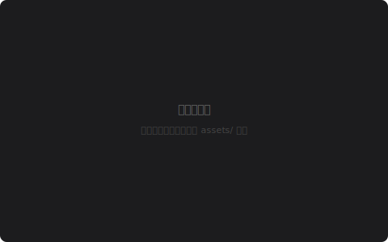

# Retrivault

> **面向 Obsidian 的 RAG 系统**——指定你的 Vault 目录，用自然语言搜索，获得带引用溯源的精准回答。

[](https://github.com/xiaoleishaw/retrivault/actions)
[](https://www.python.org/)
[](LICENSE)
[](https://github.com/astral-sh/ruff)
[](https://lancedb.github.io/lancedb/)

***

## 功能特性

- **识别 Obsidian 语法** — 解析 wikilink、tag、frontmatter、callout、embed。它理解你的 Vault，不只是纯 Markdown。
- **SSE 流式管线** — 从改写、向量化、检索、重排到生成，每一步实时推送到浏览器。没有黑箱。
- **混合搜索** — LanceDB 向量 + 全文检索融合。语义理解与关键词精度兼得。
- **智能分块** — MD 结构感知拆分，自动合并过小碎片。告别 10 个字的 chunk。
- **Query 改写** — DeepSeek Flash 生成 3 个不同表述，扩展查询，输出验证，异常自动回退。
- **重排序** — BGE-Reranker-v2-m3 Cross-Encoder 按真实相关性重排结果。
- **内置评测** — Hit Rate、MRR、Recall\@5、NDCG\@5。UI 上一键运行。
- **Provider 无关架构** — 可切换 LLM（DeepSeek / OpenAI / Ollama）、Embedding（本地 BGE-M3 / API）、向量存储，通过干净的 ABC 接口。
- **索引生命周期管理** — 首次索引、增量更新、崩溃恢复、Embedding 模型变更自动检测。全自动。

***

## 快速开始（5 分钟）

```bash
# 1. 克隆
git clone https://github.com/xiaoleishaw/retrivault.git
cd retrivault

# 2. 安装依赖
python3 -m venv .venv && source .venv/bin/activate
pip install -r requirements.txt

# 3. 配置
cp .env.example .env
# 方案 A（推荐）：DeepSeek LLM + 硅基流动 Embedding
#   → 填写 LLM_API_KEY 和 EMBEDDING_API_KEY
# 方案 B：全离线（Ollama + 本地 BGE-M3）
#   → 所有 API Key 留空，设置 LLM_PROVIDER=ollama + EMBEDDING_PROVIDER=local
# 方案 C：仅体验示例文档
#   → 填写 API Key，跳过 OBSIDIAN_VAULT_PATH

# 4. 启动
make start
# → 浏览器自动打开 http://localhost:8000
# → 自动索引 Vault → 开始搜索
```

> **没有 Vault？没问题。** Retrivault 内置了 `docs/samples/` 中的 6 篇示例文档。不配 `OBSIDIAN_VAULT_PATH` 即可自动使用。

---

## 界面预览

| 首页搜索 | SSE 管线控制台 |
|:---:|:---:|
|  |  |

| 参数设置 | RAG 评测面板 |
|:---:|:---:|
|  |  |

---

## 架构

```
┌────────────────────────────────────────────────────────────────┐
│                     浏览器（纯 HTML/CSS/JS）                     │
│  首页 → 搜索框  |  结果页 → SSE 管线实时控制台                  │
└────────────────────────┬───────────────────────────────────────┘
                         │ HTTP / SSE
┌────────────────────────┴───────────────────────────────────────┐
│                      FastAPI 层                                  │
│  POST /api/search    |  GET /api/search/stream  (SSE 事件)      │
│  POST /api/index     |  GET /api/status        |  POST /api/eval│
└────────────────────────┬───────────────────────────────────────┘
                         │
┌────────────────────────┴───────────────────────────────────────┐
│                     RAG 管线                                     │
│                                                                  │
│  扫描器 ──► 解析器 ──► 分块器 ──► Embedding ──► LanceDB         │
│     ↑                      │                    (向量 + FTS)     │
│   Obsidian              合并碎片             ┌─────────┐        │
│   vault                                     │ 检索器   │        │
│                                             └────┬────┘        │
│  Query 改写 ──► 重排器 ──► 生成器 ──► SSE 结果 │              │
│  (DeepSeek Flash) (BGE-Reranker) (你的 LLM)                    │
└─────────────────────────────────────────────────────────────────┘
```

### 管线各步骤延迟

| 步骤       | 模型                         | 平均耗时     |
| -------- | -------------------------- | -------- |
| Query 改写 | DeepSeek Flash（3 个改写）      | \~200ms  |
| 向量化      | BGE-M3（1024 维）             | \~400ms  |
| 检索       | LanceDB 混合搜索               | \~10ms   |
| 重排序      | BGE-Reranker-v2-m3         | \~350ms  |
| LLM 生成   | DeepSeek / OpenAI / Ollama | \~4s     |
| **总计**   | <br />                     | **\~5s** |

***

## 配置说明

| 文件                   | 用途            | 示例                                            |
| -------------------- | ------------- | --------------------------------------------- |
| `.env`               | 密钥 + 路径       | `LLM_API_KEY`, `OBSIDIAN_VAULT_PATH`          |
| `config/config.yaml` | 业务参数          | `chunk_size`, `top_k`, `temperature`          |
| `profiles/*.yaml`    | Provider 组合预设 | `default` (DeepSeek+BGE-M3), `ollama-offline` |

**优先级链**（后者覆盖前者）：

```
代码默认值 < profiles/*.yaml < config/config.yaml < .env < UI 面板
```

***

## 内置评测

打开 `http://localhost:8000/eval`，点击**运行评测**：

```
Hit Rate:   100%   ━━━━━━━━━━━━━━━━━━━━━━
MRR:        1.00   ━━━━━━━━━━━━━━━━━━━━━━
Recall@5:   100%   ━━━━━━━━━━━━━━━━━━━━━━
NDCG@5:     1.00   ━━━━━━━━━━━━━━━━━━━━━━
```

***

## 开发

```bash
make test       # 131 个测试，~40s
make test-cov   # 带覆盖率报告
make lint       # ruff + mypy
make fix        # 自动修复代码风格
```

***

## 项目结构

```
src/
├── interfaces/          # ABC 接口（VectorStore / LLM / Embedding）
├── pipeline/            # 扫描 → 解析 → 分块 → 检索 → 生成
├── api/                 # FastAPI：路由、模型、依赖注入
├── frontend/            # 纯 HTML/CSS/JS（无框架依赖）
├── vector_stores/       # LanceDB 实现
├── llm_providers/       # OpenAI 兼容协议（DeepSeek / OpenAI / Ollama）
├── embedding_providers/ # 本地 BGE-M3 + API Embedder
├── db/                  # SQLite 索引状态管理
├── eval/                # 评测指标（Hit Rate / MRR / NDCG）
└── config_loader.py     # 四层优先级配置合并

tests/
├── unit/                # 20+ 测试文件覆盖每个模块
├── integration/         # 端到端管线测试
└── fixtures/            # 示例 Vault + 金标数据集
```

***

## 常见问题

**为什么不用 Obsidian 自带的搜索？**\
Obsidian 原生搜索基于关键词（BM25）。Retrivault 提供**语义搜索**——它理解意图而非精确匹配。问"哪个向量数据库适合我"，它就算没有文档原话也能找到正确答案。

**需要 API Key 吗？**\
默认需要两个：[DeepSeek](https://platform.deepseek.com/api_keys)（LLM 生成 + 改写）和[硅基流动](https://cloud.siliconflow.cn)（Embedding BGE-M3）。想要完全免费？用本地 Embedding（`EMBEDDING_PROVIDER=local`，需下载约 2.2GB 模型）配合 Ollama。

**数据会发送到第三方吗？**\
取决于你的配置。使用本地 Embedding + Ollama LLM，所有数据都留在本地。

***

## 路线图

- [x] 核心 RAG 管线（扫描 → 生成）
- [x] Obsidian 语法解析（wikilink、tag、frontmatter）
- [x] SSE 流式管线实时可视化
- [x] Query 改写（3 路、验证兜底）
- [x] 内置评测体系
- [ ] 流式 LLM 生成（逐 token）
- [ ] 多轮对话上下文
- [ ] 多模态（Vault 中的图片）
- [ ] Docker 支持

***

## 开源协议

MIT © 2026 [Xiaolei Shaw](LICENSE)
